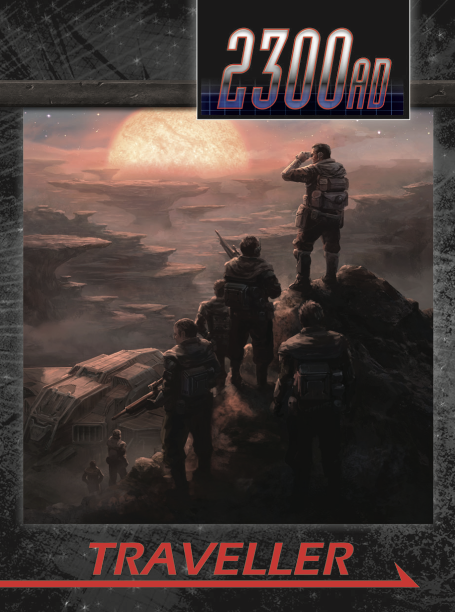

2300 AD
#########

Based on one of the most venerable Sci-Fi RPGs around (Traveller - 1977), this revival eschews a far future setting for a closer and more familiar future with all the problems and possibilities that entails.

300 years from now, the world has recovered from the Twilight, though little is known about the period following the third world war. Humanity has left the cradle of Earth and found new opportunities for exploration and, sadyly, exploitation among the nearby stars. We've also discovered that we are not alone. You are a Traveller, trying to make your way and maybe even your mark. There are plenty of hard knocks ahead, friends to be made, and most importantly adventure.

Here's a list of flims and television shows that have a similar flavor to this setting:

* Blade Runner
* Alien and Aliens
* The Expanse
* The Black Hole
* 2010
* Outlander
* Babylon 5
* Total Recall

Ready to play adventures
*************************

1. Rescue Run - The planet's name is Grendel. The weather is questionable. And you've got a job to do.