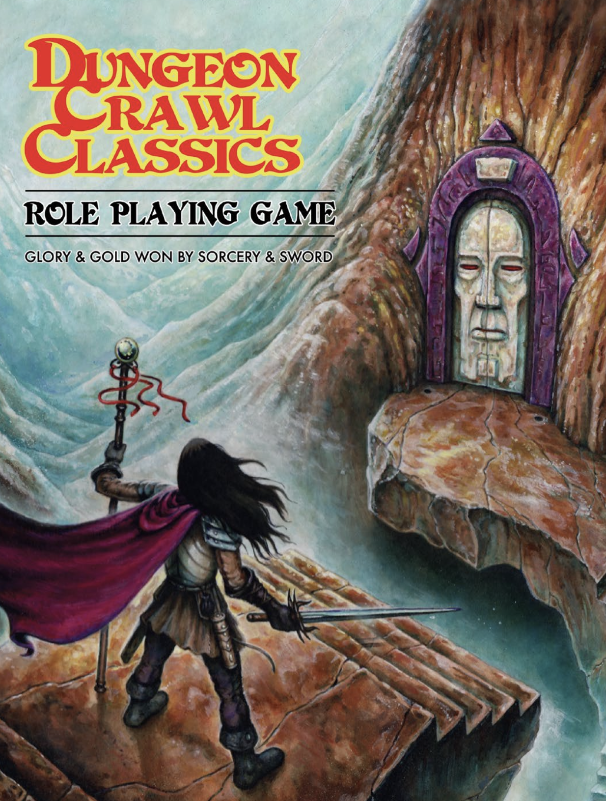

Dungeon Crawl Classics and Mutant Crawl Classics
#################################################

*Dungeon Crawl Classics* and *Mutant Crawl Classics* are new interpretations of venerable classics published by Goodman Games. Good humor and fun are a big part of what they offer.

Dungeon Crawl Classics
=========================

Inspired by Dungeons and Dragons.

Mutant Crawl Classics
=======================

Inspired by Gamma World.

Star Crawl
============

Star Crawl takes the ethos of DCC and applies it to Science-Fiction.