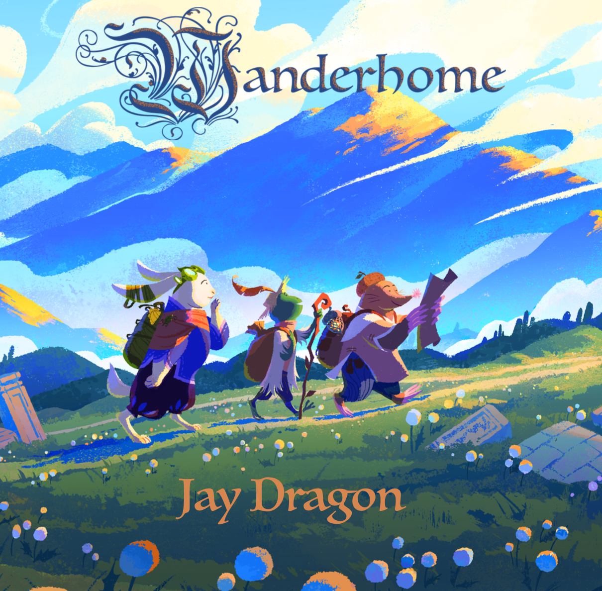

Wanderhome
############

A story telling game reminiscent of the *Wind in the Willows*. This is unlike any game I've played before, but it has a lovely, calming feel to it. Players start with *playbooks* that provide ideas of how to roleplay their characters. It's all improv from there. And there's no dice. The players determine everything that happens with their imagination.